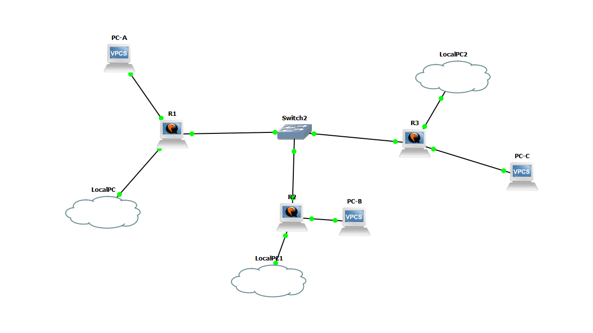

GNS3
----

.. seealso:: For more information about GNS3, check the `GNS3 homepage https://www.gns3.com/`_

Before implementing the real world solution, I first tested everything with GNS3. This allowed me to try different configurations in a safe environment. The setup looks as follows:

Because I was unable to replicate an ISP, I substituted it by using a switch. This solution isn't the exact same as it would be if there was an actual ISP, but it was good enough to simulate the intended solution.

Since the implemented solution is very similar to the simulated one, I won't go into more depth here.