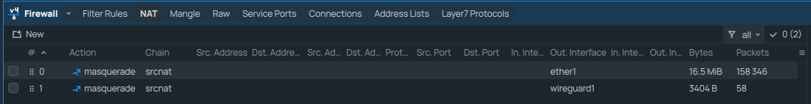
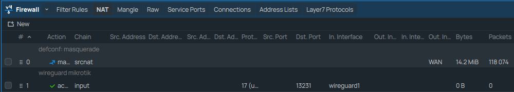

NAT
---

Network Address Translation, or NAT for short, is a way to limit the number of IP addresses private networks need. It does this by translating all local address on a network, like 192.168.0.0/24, to a public address assigned by an ISP.

.. seealso:: For more information on NAT and its different implementations, check the `Wikipedia page <https://wikipedia.org/wiki/Network_address_translation>`_

For our setup, I've opted to use the `Masquerade functionality <https://help.mikrotik.com/docs/spaces/ROS/pages/3211299/NAT#NAT-Masquerade>`_ of the MikroTik devices. This setting is similar to PAT and will allow us to use devices on our local network to connect over the VPN tunnel as well.

On router sagan, we do not need the `Masquerade functionality`_ for the WireGuard interface. This is because the devices on Sagan's local network do not need to access resources on the VPN network. As such, the only Masquerade we have is to connect to the internet.

*SepsiLab:*

*sagan:*

