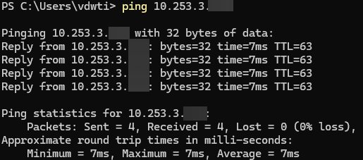
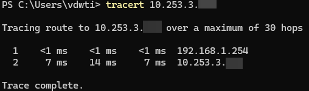
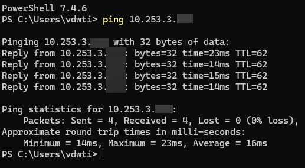
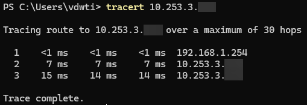

Test results
------------

And finally with all of this configured, we have connectivity between the routers.

*Ping test from local device on SepsiLab network to Sagan:*

*Traceroute test from local device on SepsiLab network to Sagan:*

*Ping test from local device on SepsiLab network to Gala:*

*Traceroute test from local device on SepsiLab network to Gala:*

