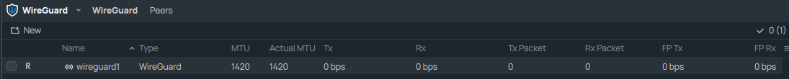
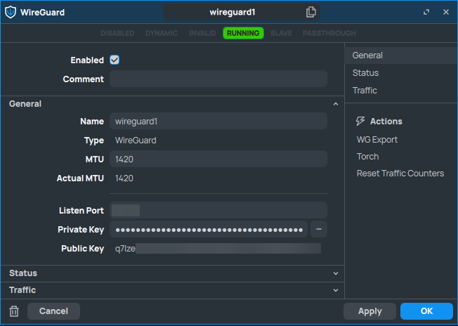
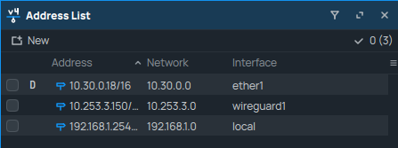
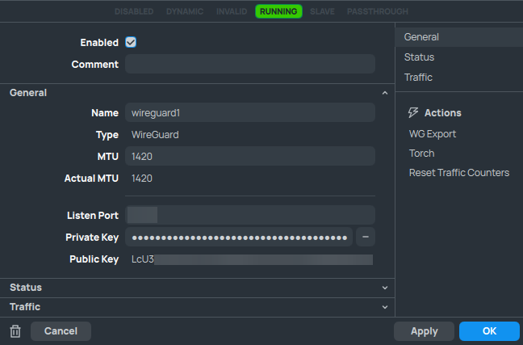
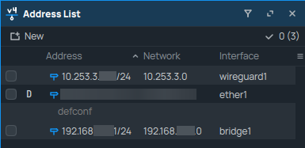
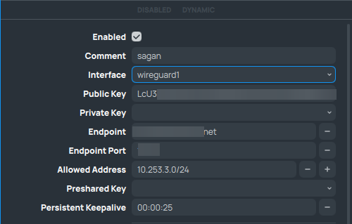
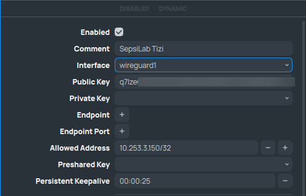

WireGuard
---------

.. seealso:: For more information on WireGuard and it's use, visit the `WireGuard website <https://www.wireguard.com/>`_

First things first, before we can setup our NAT settings and firewall, we need to create the WireGuard interfaces we need on all routers.

The interfaces look similar on all routers, the only difference will be the generated Public and Private Key and the IP address we will assign to it.

SepsiLab:

sagan:

After setting up the interface, we need to establish the WireGuard tunnel by setting up the peers. To connect the routers, we only need 1 public IP address. In our case, router sagan is the publicly reachable device. As such, we can configure the endpoint address for the SepsiLab router to point towards router sagan.

However, this does mean that the only way the WireGuard tunnel can be established, is when router SepsiLab initiates it. Router sagan will not be able to find the SepsiLab router otherwise.