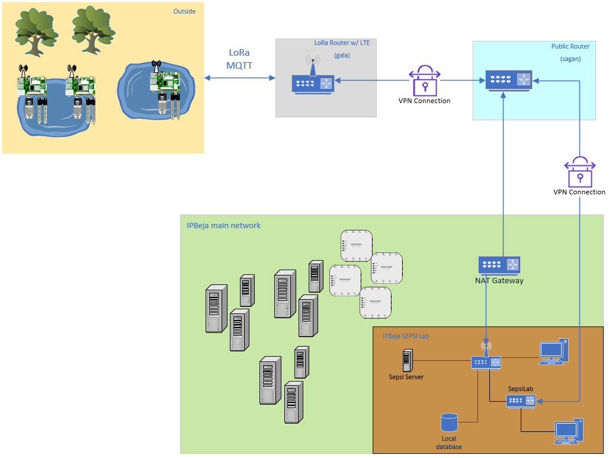

Situation
---------

To start off, it would be a good idea to understand the situation we've got going on.

Outside, several ESP-32 microcontrollers are distributed across various ponds, connected to a Raspberry Pi, each equipped with a set of Atlas Scientific sensors. These microcontrollers will be used to collect data about the ponds they are placed in, ranging from basic measurements like temperature to the pH level of the water and even the specific minerals present. The following sensors are being used:

    *	EZO™ RTD Temperature Circuit
    *	EZO™ Dissolved Oxygen Circuit
    *	EZO™ Conductivity Circuit
    *	EZO™ ORP Circuit
    *	EZO™ pH Circuit

All these devices will be connected to a MikroTik router, which can communicate with the Raspberry Pi via a LoRa connection. The Pi uses a radio antenna, typically intended for AM/FM signals, to connect with a weather station. This weather station is then linked to the LoRa router. The router will serve as a LoRa gateway, enabling all MQTT sensor data to be transmitted over a secure WireGuard VPN. This data will be uploaded to a ChirpStack server, after which it can be stored in a database for further analysis.

